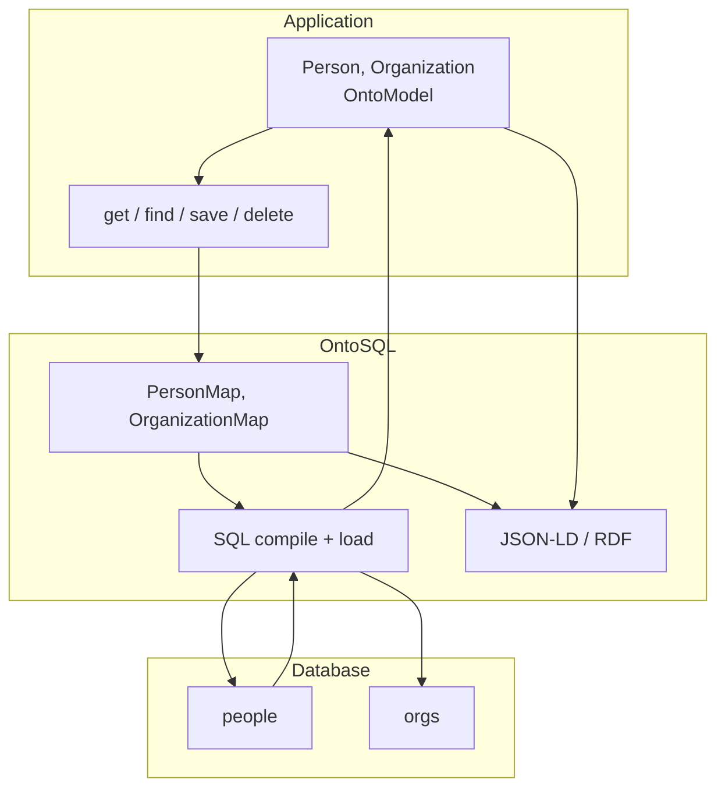
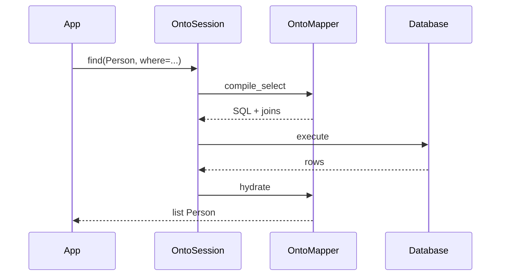

# OntoSQL Architecture

## Problem

Real databases rarely match ontology shapes one-to-one:

- One semantic concept may span several tables (person + bridge + organization).
- One table may appear in multiple API or ontology views.
- Legacy columns exist that should never surface semantically.
- Ontology properties may be computed, joined, or read-only — not simple column mappings.

OntoSQL treats **semantic models** as what application code uses, and **explicit maps** as how those models connect to SQL. Export and APIs are derived from the same definitions.

## Glossary

| Term | Meaning |
|------|---------|
| **Semantic model** / **entity** | Pydantic `OntoModel` — what routes, services, and tests hold |
| **Physical model** / **row model** | SQLModel with `table=True` — mirrors actual tables |
| **Map** / **mapper** | `OntoMapper` — declarative binding from semantic fields to SQL |
| **Session** | `OntoSession` — unit of work; compiles CRUD to SQL |

## Layers

| Layer | Tool | Responsibility |
|-------|------|----------------|
| Physical | SQLModel (`table=True`) | Tables, FKs, indexes — DB truth |
| Semantic | Pydantic (`OntoModel`) | Application concepts, validation, ontology metadata |
| Mapping | `OntoMapper`, `Map` | Field → column/join; nested entities; cascade policies |
| Runtime | `OntoSession` | Transactions, identity, query compilation |
| Interop | `export` + `fastapi` | JSON-LD, RDF, content negotiation from mapper metadata |

### Why Pydantic + SQLModel (not one model)

- **SQLModel** fits schemas that already exist in Postgres — migrations stay familiar.
- **Pydantic** fits composed entities, nested graphs, and read vs write shapes without `table=True` awkwardness.
- Keeping row models and semantic models separate avoids conflating database layout with application concepts.

## Mapping is explicit

Maps are **data you write and review**, not inference from table layout:

- Many tables → one semantic entity (joins, bridges).
- One table → many semantic maps (e.g. `schema:Person` vs `foaf:Person` views).
- Semantic-only fields (computed, constants) and physical-only columns (flags, versioning) are both supported.

See [SPECS.md](SPECS.md) for the mapper DSL and cascade policies.

## Read and write paths

**Read (`get`, `find`) — shipped in 0.2.0:**

1. Resolve `OntoMapper` for the semantic type.
2. Build a `SELECT` with required joins from field bindings.
3. Load flat rows into nested Pydantic instances.

**Write (`save`, `delete`) — planned 0.2.x / 0.3:**

1. Diff semantic instance against session state (partial updates via unset fields).
2. Plan `INSERT` / `UPDATE` / `DELETE` per physical table.
3. Apply nested **cascade policies** (`link`, `upsert`, `replace`, `ignore`) — never guessed.

## Interop

JSON-LD and RDF export will walk **semantic instances + mapper metadata** (`type_iri`, `onto_property`, IRI templates). The same `PrefixRegistry` resolves CURIEs for queries and serialization.

See [ROADMAP.md](ROADMAP.md) for SHACL, RDF import, and graph sync milestones.

## Non-goals

- Full OWL reasoning or Protégé-style ontology editing
- Arbitrary SPARQL-to-SQL as the primary query language
- Owning schema migrations (Alembic / user tooling stays in charge)
- Magical 1:1 inference from SQLAlchemy models to ontology classes

## Further reading

- [SPECS.md](SPECS.md) — API contract
- [ROADMAP.md](ROADMAP.md) — release milestones
- [DEPS.md](DEPS.md) — dependency choices
