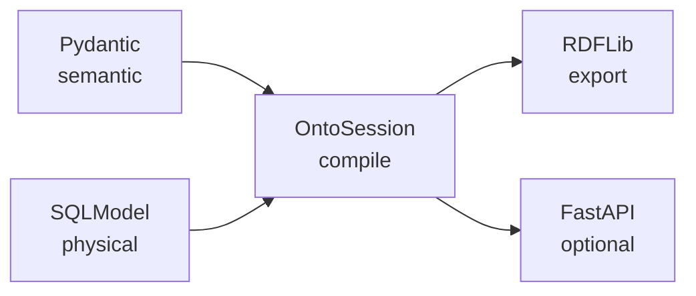

# OntoSQL Dependency Ecosystem Assessment

## Overview

This document evaluates Python dependencies for **ontosql** as a **semantic mapper and session layer** over SQL, with JSON-LD/RDF export as a derivative. The goal is a small core, optional extras, and Pythonic APIs — not a heavyweight semantic-web framework.

## Dependency philosophy

- Small, stable **core** (semantic + map + session + export)
- **SQLModel** for physical tables only; **Pydantic** for semantic entities
- RDFLib as an **internal** serialization backend where possible
- Optional extras for FastAPI, SHACL, advanced JSON-LD, graph DBs, AI
- No magical 1:1 table-to-ontology inference

## Core dependencies

### Pydantic v2

- **Semantic models** (`OntoModel`, validation, partial updates)
- JSON schema for OpenAPI enrichment (0.3+)
- Primary type surface for application code

### SQLModel

- **Physical models** (`table=True`)
- SQLAlchemy engine and session integration
- Familiar ergonomics for FastAPI teams

### SQLAlchemy 2.x

- Accessed via SQLModel
- Column expressions, joins, and compiled statements for `OntoSession`
- Core of the mapper compile path

### typing-extensions

- Typing compatibility on Python 3.10+

### RDFLib

- RDF graph construction for export
- Turtle, JSON-LD, N-Triples, RDF/XML serializers
- Namespace handling; keep behind `ontosql.export` where practical

## FastAPI ecosystem (optional extra)

### FastAPI

- Routes returning semantic instances
- Dependency-injected `OntoSession`
- Future `OntoRouter` (0.3)

### orjson

- Fast JSON-LD response bodies when `ontosql[fastapi]` is installed

## Semantic validation (future extra)

### pySHACL

- Validate graphs generated from maps + session
- Planned for 0.4 (`ontosql[shacl]`)

## JSON-LD ecosystem (future extra)

### PyLD

- Compaction, framing, expansion beyond RDFLib basics
- Planned as `ontosql[jsonld]` (0.3+)

## Graph database integrations (future)

### SPARQLWrapper

- Remote SPARQL endpoints

### Neo4j Python driver

- Hybrid SQL + property graph architectures

Not committed until graph sync adapters are specified in [ROADMAP.md](ROADMAP.md).

## AI and LLM ecosystem (long-term)

### Instructor / PydanticAI

- Structured extraction into `OntoModel` instances
- Aligns with semantic-layer-first design

### DeepOnto

- Ontology alignment and embeddings (research-oriented)

## Developer tooling

| Package | Role |
|---------|------|
| pytest | Tests |
| pytest-cov | Coverage |
| pytest-xdist | Parallel runs |
| ty | Static typing (`src/ontosql`) |
| ruff | Lint and format |
| httpx | FastAPI integration tests |
| hatchling | Wheel build |

### mkdocs-material (future)

- Documentation site for 1.0 — not required for 0.2 docs-in-repo

## Extras in pyproject.toml

```toml
[project.optional-dependencies]
fastapi = ["fastapi>=0.100", "orjson>=3.9"]
dev = ["pytest", "pytest-cov", "ty", "ruff", "httpx", "fastapi", "orjson", "aiosqlite", ...]
# Planned extras:
# jsonld = ["PyLD"]
# shacl = ["pySHACL"]
# graphdb = ["SPARQLWrapper", "neo4j"]
# ai = ["instructor", "pydantic-ai"]
```

Install examples:

```bash
pip install ontosql
pip install ontosql[fastapi]
pip install -e ".[dev]"
```

## Layer → dependency map



## Strategic recommendations

**Strongest foundational dependencies:**

- Pydantic (semantic)
- SQLModel + SQLAlchemy (physical + compile)
- RDFLib (export)

**Highest-value optional integrations:**

- FastAPI + orjson
- PyLD (framing)
- pySHACL (validation)

**Highest long-term opportunities:**

- PydanticAI / Instructor
- Graph DB adapters
- Polars for ETL pipelines over semantic rows

OntoSQL should expose **semantic model and session APIs**; RDFLib should remain an implementation detail for application developers except when calling `to_rdf()` or using FastAPI negotiation helpers.

## Related documents

- [ARCHITECTURE.md](ARCHITECTURE.md)
- [SPECS.md](SPECS.md)
- [ROADMAP.md](ROADMAP.md)
